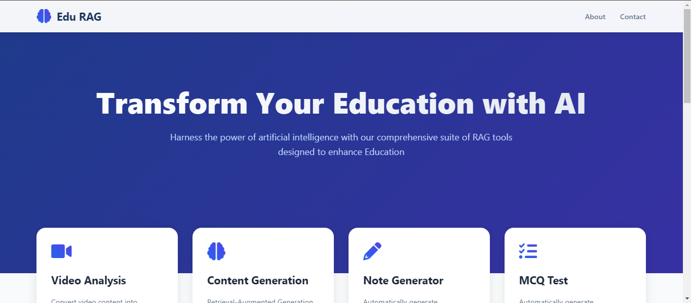

# Multilingual Education Platform

## 🚀 Overview

The **Multilingual Education Platform** transforms educational content interaction using cutting-edge AI technologies. This award-winning platform provides comprehensive tools for video-to-PDF conversion, content summarization, question generation, multilingual notes creation, and personalized learning experiences.

Recognized for innovation with **2nd Place** at **Hack Beyond Limit** (Rathinam College of Arts and Science, Coimbatore).

## 📊 Main Interface




## ✨ Key Features

### 🎥 Video to PDF Conversion
- **Technology**: YOLO + OCR
- **Process**: Extracts text and images from videos to create comprehensive PDF documents
- **Use Case**: Ideal for converting lecture videos into study materials

### 📝 RAG Content Summarizer
- **Technology**: Retrieval-Augmented Generation
- **Capabilities**: 
  - Generates concise, high-quality summaries
  - Allows users to ask contextual questions about the content
  - Provides accurate responses based on document context


### ❓ MCQ Generation
- **Technology**: BART model
- **Features**: Generates customizable number of multiple-choice questions from PDF documents
- **Use Case**: Perfect for educators preparing assessments


### 📚 Notes Generation (English)
- **Technology**: Mixtral-8x and B-32768
- **Output**: Detailed, coherent notes from PDF content
- **Use Case**: Helps students digest long-form content efficiently


### 🌏 Tamil Content Support
- **Features**:
  - RAG-powered Tamil content summarization
  - Tamil language doubt resolution
  - Notes generation in Tamil using Mixtral-8x7B-32768 and GroQ


### 👨‍🎓 Personal Learning Tool
- **Technology**: Custom AI algorithms
- **Capabilities**: Creates personalized learning with the content and check our capacity of content observation.
- **Benefits**: Adapts to individual learning pace and knowledge level


## 🏆 Achievements

- **2nd Place** at **Hack Beyond Limit 2025** (Rathinam College of Arts and Science, Coimbatore)

## 👥 Team Members

- **Thillainatarajan B**
- **Siva Prakash S**
- **Sridhar**

## 🔧 Technologies Used

| Technology | Purpose |
|------------|---------|
| YOLO | Real-time object detection |
| OCR | Text extraction from images and videos |
| RAG | Content summarization and question answering |
| BART | Automatic MCQ generation |
| Mixtral-8x & B-32768 | English notes generation |
| GroQ | Enhanced Tamil notes generation |
| Python, TensorFlow, PyTorch | Core development technologies |

## 📋 Installation and Setup

### Prerequisites
- Python 3.8+
- TensorFlow, PyTorch, Transformers
- Sufficient system resources (RAM and GPU)

### Installation Steps

```bash
# Clone the repository
git clone https: https://github.com/THILLAINATARAJAN-B/Multilingual-Education-Platform

# Navigate to project directory
cd Multilingual-Education-Platform

# Install dependencies
pip install -r requirements.txt

# Launch the platform
python run.py
```

## 🤝 Contributing

We welcome contributions from the community! Here's how to contribute:

1. Fork the repository
2. Create a feature branch (`git checkout -b feature/amazing-feature`)
3. Commit your changes (`git commit -m 'Add some amazing feature'`)
4. Push to the branch (`git push origin feature/amazing-feature`)
5. Open a Pull Request with detailed description

## 📄 License

This project is licensed under the MIT License - see the [LICENSE](LICENSE) file for details.

## 🙏 Acknowledgments

- We would also like to extend our deepest appreciation to our mentors and professors at Rathinam College of Arts and Science and Anna University RC Campus for their guidance, encouragement, and continuous support.
- We would like to express our sincere gratitude to our team members of Edu Horizon for their dedication and hard work in bringing this project to life.
- A special thank you to all contributors for their valuable input and support throughout the development process.

---
⭐️ Star this project if you find it helpful!
