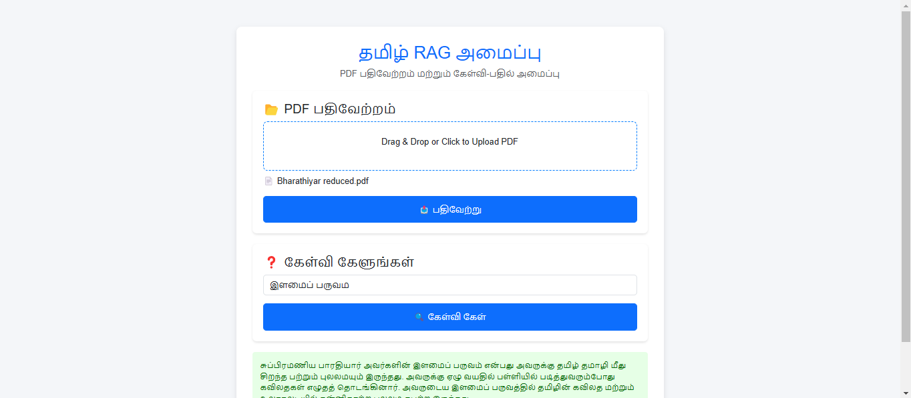

# Multilingual Education Platform

**Hack Beyond Limit - 2nd Place Winner**  
*Rathinam College of Arts and Science, Coimbatore*

## Overview
The **Multilingual Education Platform** is designed to revolutionize how students and educators interact with content. This innovative platform provides a suite of advanced tools that leverage state-of-the-art technologies like YOLO, OCR, RAG (Retrieval-Augmented Generation), BART, Mixtral-8x, and GroQ. It is a one-stop solution for converting video to PDF, summarizing and questioning content, generating notes, and much more—catered to multilingual content support.

This platform was recognized for its innovation by securing **2nd place** at **Hack Beyond Limit**, hosted at Rathinam College of Arts and Science, Coimbatore.
##Main Interface
       
     ![Interface extended(images/interface_extended.png)
## Key Features

### 1. **Video to PDF Conversion (YOLO to OCR to PDF)**
   - **Input**: Video File
   - **Output**: PDF Document
   - The platform extracts relevant text and images from videos, converting them into a comprehensive PDF. The process uses **YOLO** for object detection and **OCR (Optical Character Recognition)** for extracting text, ultimately outputting a detailed PDF.

### 2. **RAG Content Summarizer**
   - **Input**: Any content (e.g., documents, articles)
   - **Output**: A concise summary
   - The **RAG (Retrieval-Augmented Generation)** model intelligently summarizes content by retrieving relevant information from large datasets and generating a precise, high-quality summary.
   - The platform allows users to ask **questions** about the summarized content, receiving accurate responses based on the context.
   - **Example Output**:  
     

### 3. **MCQ Generation**
   - **Input**: PDF Document
   - **Output**: Customizable number of MCQs (Multiple Choice Questions)
   - Using the **BART model**, the platform automatically generates MCQs based on the content of an input PDF. Users can specify how many questions they need, making this tool ideal for teachers preparing exams or quizzes.
   - **Example Output**:  
     

### 4. **Notes Generation (English)**
   - **Input**: PDF Document
   - **Output**: Notes in English
   - Powered by **Mixtral-8x** and **B-32768**, this feature generates detailed, coherent notes in English from any input PDF. Ideal for students who need concise, digestible information from long-form content.
   - **Example Output**:  
     

### 5. **RAG for Tamil Content and Doubt Questioning**
   - **Input**: Tamil PDF Document
   - **Output**: Summarized content and answers in Tamil
   - This feature leverages **RAG** to summarize content in Tamil and allows users to ask doubts in Tamil. The system answers queries in Tamil, ensuring users receive localized and relevant responses.
   - **Example Output**:  
     

### 6. **Notes Generation (Tamil)**
   - **Input**: Tamil PDF Document
   - **Output**: Notes in Tamil
   - Similar to the English note generation feature, this tool uses **Mixtral-8x7B-32768** and **GroQ** for efficient note generation in Tamil, making the platform highly useful for Tamil-speaking users.

### 7. **Personal Learning Tool**
   - **Input**: Personalized User Data, Content, and Learning Goals
   - **Output**: Custom learning paths, quizzes, and assessments based on the user’s progress
   - The **Personal Learning Tool** provides students with personalized learning experiences by dynamically generating customized learning paths. It integrates quizzes, assessments, and course materials tailored to the user’s knowledge level and learning pace.
   - **Example Output**:  
       

## Achievements

- **Hack Beyond Limit 2025** - **2nd Place**  
  The team secured **2nd place** at **Hack Beyond Limit**, a prestigious hackathon hosted at Rathinam College of Arts and Science, Coimbatore, for developing this innovative education platform.

## Team Members

- **Thillainatarajan B**
- **Siva Prakash S**
- **Sridhar**

## Technologies Used
- **YOLO**: Real-time object detection
- **OCR (Optical Character Recognition)**: Text extraction from images and videos
- **RAG (Retrieval-Augmented Generation)**: For summarizing content and answering questions
- **BART**: For automatic MCQ generation
- **Mixtral-8x** & **B-32768**: For generating English notes
- **GroQ**: For accelerating AI computations and enhancing the performance of note generation (Tamil)
- **Python, TensorFlow, PyTorch**: Core technologies

## Installation and Setup

### Prerequisites
- Python 3.8 or later
- TensorFlow, PyTorch, Transformers, and other dependencies
- Ensure you have enough system resources (RAM and GPU) to handle large model workloads

### Steps
1. Clone the repository:
   ```bash
   git clone https://github.com/THILLAINATARAJAN-B/opentrack.git
   ```
2. Navigate to the project directory:
   ```bash
   cd opentrack
   ```
3. Install the required dependencies:
   ```bash
   pip install -r requirements.txt
   ```
4. Run the platform:
   ```bash
   python run.py
   ```

## Contribution

We welcome contributions from the community! To contribute:

1. Fork the repository.
2. Create a new branch for your feature/fix.
3. Commit your changes and push to your fork.
4. Submit a pull request with a detailed explanation of your changes.

## License

This project is licensed under the MIT License - see the [LICENSE](LICENSE) file for details.
